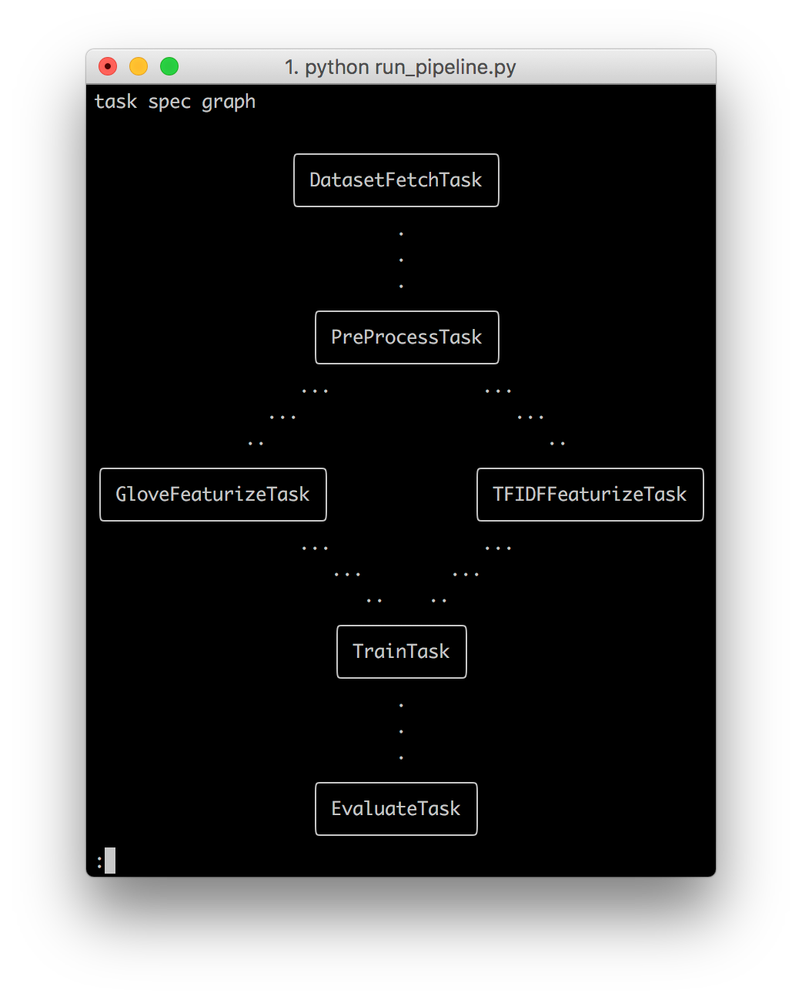
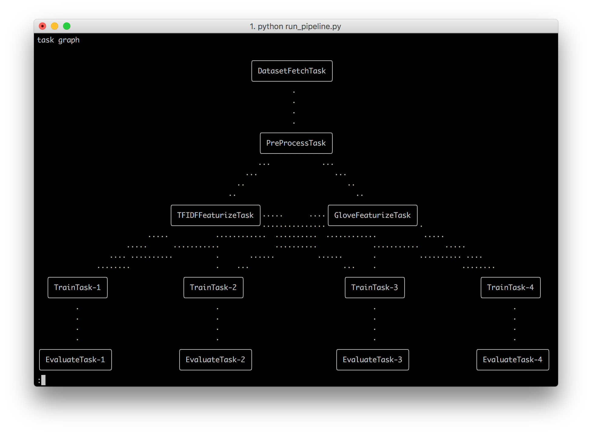

<div align="center">


_Develop ML pipelines fluently with no boilerplate code. Focus only on your tasks and not the boilerplate!_

---

<p align="center">
  <a href="#key-features">Key Features</a> •
  <a href="#getting-started">Getting Started</a> •
  <a href="#functionality">Functionality</a> •
  <a href="#examples">Examples</a> •
  <a href="#citation">Citation</a>
</p>

[](https://pypi.org/project/fluidml/)
[](https://opensource.org/licenses/Apache-2.0)
[](https://circleci.com/gh/fluidml/fluidml/tree/main)
[](https://codecov.io/gh/fluidml/fluidml)
[](https://fluidml.readthedocs.io/en/latest/?badge=latest)
[](https://github.com/fluidml/fluidml/blob/main/CODE_OF_CONDUCT.md)

[//]: # (?style=flat-square)

</div>

---

**FluidML** is a lightweight framework for developing machine learning pipelines.

<div align="center">

</div>

Developing machine learning models is a challenging process, with a wide range of sub-tasks: 
data collection, pre-processing, model development, hyper-parameter tuning and deployment. 
Each of these tasks is iterative in nature and requires lot of iterations to get it right with good performance.

Due to this, each task is generally developed sequentially, with artifacts from one task being fed as inputs to the subsequent tasks. 
For instance, raw datasets are first cleaned, pre-processed, featurized and stored as iterable datasets (on disk), which are then used for model training. 
However, this type of development can become messy and un-maintenable quickly for several reasons:

- pipeline code may be split across multiple scripts whose dependencies are not modeled explicitly
- each of this task contains boilerplate code to collect results from previous tasks (eg: reading from disk)
- hard to keep track of task artifacts and their different versions
- hyper-parameter tuning adds further complexity and boilerplate code

FluidML attempts to solve all of the above issues without restricting the user's flexibility.

## Key Features

FluidML provides following functionalities out-of-the-box:

- **Task Graphs** - Create ML pipelines as a directed task graph using simple APIs
- **Results Forwarding** - Results from tasks are automatically forwarded to downstream tasks based on dependencies
- **Parallel Processing** - Execute the task graph parallely with multi-processing
- **Grid Search** - Extend the task graph by enabling grid search on tasks with just one line of code
- **Result Caching** - Task results are persistently cached in a results store (e.g.: Local File Store or a MongoDB Store) and made available for subsequent runs without executing the tasks again and again
- **Flexibility** - Provides full control on your task implementations. You are free to choose any framework of your choice (Sklearn, TensorFlow, Pytorch, Keras, or any of your favorite library)

---

## Getting Started

### Installation

#### 1. From Pip
Simply execute:  
```bash
$ pip install fluidml
```

#### 2. From Source
1. Clone the repository,
2. Navigate into the cloned directory (contains the setup.py file),
3. Execute `$ pip install .`

**Note:** To run demo examples, execute `$ pip install fluidml[examples]` (Pip) or `$ pip install .[examples]` (Source) to install the additional requirements.

### Minimal Example

This minimal toy example showcases how to get started with FluidML.
For real machine learning examples, check the "Examples" section below.

#### 1. Define Tasks

First, we define some toy machine learning tasks. A Task can be implemented as a function or as a class inheriting from our `Task` class.

In case of the class approach, each task must implement the `run()` method, which takes some inputs and performs the desired functionality. 
These inputs are actually the results from predecessor tasks and are automatically forwarded by FluidML based on registered task dependencies. 
If the task has any hyper-parameters, they can be defined as arguments in the constructor. 
Additionally, within each task, users have access to special `Task` methods and attributes like 
`self.save()` and `self.resource` to save a result and access task resources (more on that later).

```Python
from fluidml import Task


class MyTask(Task):
    def __init__(self, config_param_1, config_param_2):
        ...
    def run(self, predecessor_result_1, predecessor_result_2):
        ...
```

or

```Python
def my_task(predecessor_result_1, predecessor_result_2, config_param_1, config_param_2, task: Task):
    ...
```

In the case of defining the task as callable, an extra task object is provided to the task,
which makes important internal attributes and functions like `task.save()` and `task.resource` available to the user.

Below, we define standard machine learning tasks such as dataset preparation, pre-processing, featurization and model training using Task classes.
Notice that:

- Each task is implemented individually and it's clear what the inputs are (check arguments of `run()` method)
- Each task saves its results using `self.save(...)` by providing the object to be saved and a unique name for it. 
  This unique name corresponds to input names in successor task definitions.

```Python
class DatasetFetchTask(Task):
    def run(self):
        ...           
        self.save(obj=data_fetch_result, name="data_fetch_result")


class PreProcessTask(Task):
    def __init__(self, pre_processing_steps: List[str]):
        super().__init__()
        self._pre_processing_steps = pre_processing_steps

    def run(self, data_fetch_result):
        ...
        self.save(obj=pre_process_result, name="pre_process_result")


class TFIDFFeaturizeTask(Task):
    def __init__(self, min_df: int, max_features: int):
        super().__init__()
        self._min_df = min_df
        self._max_features = max_features

    def run(self, pre_process_result):
        ...
        self.save(obj=tfidf_featurize_result, name="tfidf_featurize_result")


class GloveFeaturizeTask(Task):
    def run(self, pre_process_result):
        ...
        self.save(obj=glove_featurize_result, name="glove_featurize_result")


class TrainTask(Task):
    def __init__(self, max_iter: int, balanced: str):
        super().__init__()
        self._max_iter = max_iter
        self._class_weight = "balanced" if balanced else None

    def run(self, tfidf_featurize_result, glove_featurize_result):
        ...
        self.save(obj=train_result, name="train_result")


class EvaluateTask(Task):
    def run(self, train_result):
        ...
        self.save(obj=evaluate_result, name="evaluate_result")
```

#### 2. Task Specifications

Next, we can create the defined tasks with their specifications. 
We now only write their specifications, later these are used to create real instances of tasks by FluidML.

Note the `config` argument holds the configuration of the task (i.e. hyper-parameters).


```Python
from fluidml import TaskSpec


dataset_fetch_task = TaskSpec(task=DatasetFetchTask)
pre_process_task = TaskSpec(task=PreProcessTask, config={"pre_processing_steps": ["lower_case", "remove_punct"]})
featurize_task_1 = TaskSpec(task=GloveFeaturizeTask)
featurize_task_2 = TaskSpec(task=TFIDFFeaturizeTask, config={"min_df": 5, "max_features": 1000})
train_task = TaskSpec(task=TrainTask, config={"max_iter": 50, "balanced": True})
evaluate_task = TaskSpec(task=EvaluateTask)
```

#### 3. Registering task dependencies

Here we create the task graph by registering dependencies between the tasks. 
In particular, for each task specifier, you can register a list of predecessor tasks using the `requires()` method.

```Python
pre_process_task.requires(dataset_fetch_task)
featurize_task_1.requires(pre_process_task)
featurize_task_2.requires(pre_process_task)
train_task.requires(dataset_fetch_task, featurize_task_1, featurize_task_2)
evaluate_task.requires(dataset_fetch_task, featurize_task_1, featurize_task_2, train_task)
```

#### 4. Configure Logging

FluidML internally utilizes Python's `logging` library. However, we refrain from configuring a logger object with handlers
and formatters since each user has different logging needs and preferences. Hence, if you want to use FluidML's logging
capability, you just have to do the configuration yourself. For convenience, we provide a simple utility function which
configures a visually appealing logger (using a specific handler from the [rich](https://github.com/willmcgugan/rich) library).

We highly recommend to enable logging in your fluidml application in order to benefit from console progress logging.

```python
from fluidml import configure_logging


configure_logging()
```

#### 5. Run tasks using Flow

Now that we have all the tasks specified, we can just run the task graph. 
For that, we create the task flow by passing all tasks to the `Flow()` class.
Subsequently, we execute the task graph by calling `flow.run()`.

```Python
from fluidml import Flow


tasks = [dataset_fetch_task, pre_process_task, featurize_task_1,
         featurize_task_2, train_task, evaluate_task]

flow = Flow(tasks=tasks)
results = flow.run()
```

---

## Functionality

The following sections highlight the most important features and options when specifying and executing a task pipeline.
For a complete documentation of all available options we refer to the [API documentation](https://fluidml.readthedocs.io/en/latest/).

### Grid Search - Automatic Task Expansion

We can easily enable grid search for our tasks with just one line of code. 
We just have to provide the `expand` argument with the `product` and `zip` expansion option to the `TaskSpec` constructor. 
Automatically, all `List` elements in the provided config are recursively unpacked and taken into account for expansion.
If a list itself is an argument and should not be expanded, it has to be wrapped again in a list. 

```Python
train_task = TaskSpec(
  task=TrainTask,
  config={"max_iter": [50, 100], "balanced": [True, False], "layers": [[50, 100, 50]]},
  expand="product",  # or 'zip'
)
```

That's it! Flow expands this task specification into 4 tasks with provided cross product combinations of `max_iter` and `balanced`. 
Alternatively, using `zip` the expansion method would result in 2 expanded tasks, 
with the respective `max_iter` and `balanced` combinations of `(50, True), (100, False)`. 

Note `layers` is not considered for different grid search realizations since it will be unpacked and the actual list 
value will be passed to the task.
Further, any successor tasks (for instance, evaluate task) in the task graph will also be automatically expanded. 
Therefore, in our example, we would have 4 evaluate tasks, each one corresponding to the 4 train tasks.

For more advanced Gird Search Expansion options we refer to the documentation.


### Model Selection

Running a complete machine learning pipeline usually yields trained models for many grid search parameter combinations.
A common goal is then to automatically determine the best hyper-parameter setup and the best performing model.
FluidML enables just that by providing a `reduce=True` argument to the `TaskSpec` class. Hence, to automatically 
compare the 4 evaluate tasks and select the best performing model, we implement an additional `ModelSelectionTask`
which gets wrapped by our `TaskSpec` class.

```Python
class ModelSelectionTask(Task):
    def run(self, train_result: List[Sweep]):
        # from all trained models/hyper-parameter combinations, determine the best performing model
        ...

model_selection_task = TaskSpec(task=ModelSelectionTask, reduce=True)

model_selection_task.requires(evaluate_task)
```

The important `reduce=True` argument enables that a single `ModelSelectionTask` instance gets the training results
from all grid search expanded predecessor tasks.
`train_result` is of type `List[Sweep]` and holds the results and configs of all specified grid search parameter combination. For example:

```Python
train_result = [
    Sweep(value=value_1, config={...}),  # first unique parameter combination config
    Sweep(value=value_2, config={...}),  # second unique parameter combination config
    ...
]
```

### Result Store

FluidML provides the `ResultStore` interface to efficiently save, load and delete task results. Internally, the result store is used
to automatically collect saved predecessor results and pass the collected results as inputs to defined successor tasks.

By default, results of tasks are stored in an `InMemoryStore`, which might be impractical for large datasets/models or long running tasks since the results are not persistent. 
To have persistent storage, FluidML provides two fully implemented `ResultsStore` namely `LocalFileStore` and `MongoDBStore`.

Additionally, users can provide their own results store to `Flow.run()` by inheriting from the `ResultsStore` interface 
and implementing `load()`, `save()`, `delete()`, `delete_run()` and `get_context()` methods. 
Note these methods rely on task name and its config parameters, which act as lookup-key for results. 
In this way, tasks are skipped by FluidML when task results are already available for the given config. 
But users can override and force execute tasks by passing `force` parameter to the `Flow.run()` methods. 
For details check the API documentation.

```Python
class MyResultsStore(ResultsStore):
    def load(self, name: str, task_name: str, task_unique_config: Dict, **kwargs) -> Optional[Any]:
        """ Query method to load an object based on its name, task_name and task_config if it exists """
        raise NotImplementedError

    def save(self, obj: Any, name: str, type_: str, task_name: str, task_unique_config: Dict, **kwargs):
        """ Method to save/update any artifact """
        raise NotImplementedError

    def delete(self, name: str, task_name: str, task_unique_config: Dict):
        """ Method to delete any artifact """
        raise NotImplementedError

    def delete_run(self, task_name: str, task_unique_config: Dict):
        """Method to delete all task results from a given run config"""
        raise NotImplementedError

    def get_context(self, task_name: str, task_unique_config: Dict) -> StoreContext:
        """Method to get store specific storage context, e.g. the current run directory for Local File Store"""
        raise NotImplementedError
```

We can instantiate for example a `LocalFileStore`

```python
results_store = LocalFileStore(base_dir="/some/dir")
```

and use it to enable persistent results storing via `flow.run(results_store=results_store)`.

### Multiprocessing

FluidML automatically infers the optimal number of worker processes based on the expanded task graph and the number of available CPUs
in your system. If the resulting number is greater than 1, `Flow` will automatically run the graph in parallel using multiprocessing.
If 1 worker is optimal and no multiprocessing is needed, the task graph will be executed in the main process without multiprocessing.

You can manually control the number of workers by providing the `num_workers` argument to `flow.run()`.

### Logging

Internally, FluidML makes use of Python's `logging` library to visualize and log the progress of the task pipeline execution
in the console. We recommend to configure `logging` in your fluidml application for a better user experience.
For convenience, we provide a simple utility function `configure_logging()` which configures a visually appealing logger 
(using a specific handler from the [rich](https://github.com/willmcgugan/rich) library). For different logging options 
we refer to the documentation.

In the case of executing the task graph in parallel with multiple workers using multiprocessing, the console output might become
garbled and unreadable. In that scenario you can turn on [tmux](https://github.com/tmux/tmux/wiki) logging py providing the `log_to_tmux` argument:
`flow.run(log_to_tmux=True)`. In addition to the standard console, a `tmux` terminal session with `num_worker` panes is automatically started.
Each worker process logs to a dedicated pane in the tmux session so that the console output is nicely readable.

Note `log_to_tmux=True` requires the [installation](https://github.com/tmux/tmux/wiki/Installing) of tmux.


### Visualization

FluidML provides functions to visualize the original task specification graph as well as the (potentially expanded) task graph, which facilitates debugging.
After instantiating the `Flow` object we have access to the task specification graph `flow.task_spec_graph` and the
expanded task graph `flow.task_graph`.

Both graphs can be visualized in the console `visualize_graph_in_console` or in the browser or a jupyter notebook `visualize_graph_interactive`.

```Python
from fluidml.visualization import visualize_graph_in_console, visualize_graph_interactive


flow = Flow(tasks=tasks)

visualize_graph_in_console(graph=flow.task_spec_graph)
visualize_graph_interactive(graph=flow.task_graph, browser="firefox")
```
When using console visualization the default arguments `use_pager=True` and `use_unicode=False` will render the graph in ascii within a pager for horizontal scrolling support. 
If `use_pager=False` the graph is simply printed and if `use_unicode=True` a visually more appealing unicode character set is used for console rendering. 
However not every console supports unicode characters.

See below the console visualization of the task specification graph and the expanded task graph from our minimal example:

<div align="center">

</div>

<div align="center">

</div>

When using interactive visualization the default output is to a running jupyter notebook.
If you want the graph to be rendered in a browser, provide the `browser` argument to `visualize_graph_interactive()`, e.g. 
`visualize_graph_interactive(graph=flow.task_graph, browser="chrome")`. You might receive a `webbrowser` error: 
`webbrowser.Error: could not locate runnable browser` which means that you have to register the browser manually so that
Python's `webbrowser` library can find it. Registering can be done via

```python
import webbrowser
webbrowser.register(
  "chrome", None, webbrowser.BackgroundBrowser("/path/to/chrome/executable")
)
```

---

## Examples

For real machine learning pipelines including grid search implemented with FluidML, check our
Jupyter Notebook tutorials:

- [Transformer based Sequence to Sequence Translation (PyTorch)](https://github.com/fluidml/fluidml/blob/main/examples/pytorch_transformer_seq2seq_translation/transformer_seq2seq_translation.ipynb)
- [Multi-class Text Classification (Sklearn)](https://github.com/fluidml/fluidml/blob/main/examples/sklearn_text_classification/sklearn_text_classification.ipynb)

---

## Citation

```
@article{fluid_ml,
  title = {FluidML - a lightweight framework for developing machine learning pipelines},
  author = {Hillebrand, Lars and Ramamurthy, Rajkumar},
  year = {2020},
  publisher = {GitHub},
  journal = {GitHub repository},
  howpublished = {\url{https://github.com/fluidml/fluidml}},
}
```
